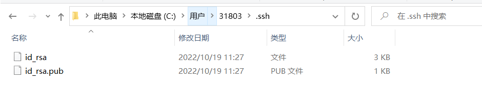

# Git 上传本地文件☞github 

# 方法一

## 1.girethub创建repository

```
Repository name: 仓库名称（输入名字，最好不要使用中文）

Description(可选): 仓库描述介绍

Public, Private : 仓库权限（公开共享，私有或指定合作者）

Initialize this repository with a README: 添加一个README.md

gitignore: 不需要进行版本管理的仓库类型，对应生成文件.gitignore

license: 证书类型，对应生成文件LICENSE
```

## 2.记录repository网址


## 3.Git Bash

本地文件操作

```
右键你的项目，如果你之前安装git成功的话，右键会出现两个新选项，分别为Git Gui Here,Git Bash Here,这里我们选择Git Bash Here
```


## 4把github上的repository克隆到本地

# 方法二

## 1.创建本地库（需要上传的文件夹）

```
可以直接右击新建文件夹，也可以右击打开Git bash命令行窗口通过命令来创建(mkdir)
```

## 2.git init 

通过命令git init把这个文件夹变成Git可管理的仓库 ，这时你会发现本地库里面多了个.git文件夹，它是Git用来跟踪和管理版本库的。如果你看不到，是因为它默认是隐藏文件，那你就需要设置一下让隐藏文件可见。 


## 3.git status 

```
git status 查看本地库未add到Git仓库的项目
```

这时候你就可以把你的项目粘贴到这个本地Git仓库里面（粘贴后你可以通过git status来查看你当前的状态），然后通过git add把项目添加到仓库（或git add .把该目录下的所有文件添加到仓库，注意点是用空格隔开的）。在这个过程中你其实可以一直使用git status来查看你当前的状态。 


 这里提示你虽然把项目粘贴过来了，但还没有add到Git仓库上，然后我们通过git add .把刚才复制过来的项目全部添加到仓库

```
git add . 把所在目录文件夹下所有项目添加到Git仓库
也可以通过git add workfilename  把workfile添加到Git仓库
```


## 4.git commit

```
用git commit把项目提交到仓库。
```


 -m后面引号里面是本次提交的注释内容，这个可以不写，但最好写上，不然会报错


本地Git仓库到此工作做完了，下面就到了连接远程仓库（也就是连接Github）

## 5.SSH KEY

由于本地Git仓库和Github仓库之间的传输是通过SSH加密的，所以连接时需要设置一下：

先看一下你C盘用户目录下有没有.ssh目录，有的话看下里面有没有id_rsa和id_rsa.pub这两个文件，有就跳到下一步，没有就通过下面命令创建。

```
$ ssh-keygen -t rsa -C "youremail@example.com" 注意ssh-keygen之间没有空格
```

然后回车，询问保存key的位置，默认是在括号里的路径下，你可以修改，也可以不做修改。


这里不修改，回车，提示已存在，是否覆盖。因为我这是第二次，所以有这个提示如下题所示：

为了不必要麻烦，还是不要设置密码，因为容易忘记，不输入密码，回车，如下图所示：


确认密码不输入，回车。出现上图结果，表明创建key成功！

这时你就会在用户下的.ssh目录里找到id_rsa和id_rsa.pub这两个文件  



## 6.SSH key 加密

登录Github,找到右上角的图标，打开点进里面的Settings，再选中里面的SSH and GPG KEYS，点击右上角的New SSH key，然后Title里面随便填，再把刚才id_rsa.pub里面的内容复制到Title下面的Key内容框里面，最后点击Add SSH key，这样就完成了SSH Key的加密。具体步骤也可看下面：


之后会Confirm Access，输入github账户密码即可。

## 7.在github上创建一个Git仓库

直接点New repository来创建


## 8.Git仓库与本地仓库关联

在Github上创建好Git仓库之后我们就可以和本地仓库进行关联了，根据创建好的Git仓库页面的提示，可以在本地仓库的命令行输入：

```
$ git remote add origin url (url根据自己仓库的地址进行填写)
```

注意origin后面加的是你Github上创建好的仓库的地址。

## 9.推送本地仓库到远程仓库

关联好之后我们就可以把本地库的所有内容推送到远程仓库（也就是Github）上了，通过：

$ git push -u origin master       由于新建的远程仓库是空的，所以要加上-u这个参数，等远程仓库里面有了内容之后，下次再从本地库上传内容的时候只需下面这样就可以了： $ git push origin master        上传项目的过程可能需要等一段时间，完成之后是这样的：


 至此就完成了将本地项目上传到Github的整个过程。

​      另外，这里有个坑需要注意一下，就是在上面第七步创建远程仓库的时候，如果你勾选了Initialize this repository with a README（就是创建仓库的时候自动给你创建一个README文件），那么到了第九步你将本地仓库内容推送到远程仓库的时候就会报一个failed to push some refs to https://github.com/Lijingbohere/Lijingbohere.git的错。

​      这是由于你新创建的那个仓库里面的README文件不在本地仓库目录中，这时我们可以通过以下命令先将内容合并以下：

```javascript
$ git pull --rebase origin master
```

复制

​       这时你再push就能成功了。

​     总结：其实只需要进行下面几步就能把本地项目上传到Github

​     1、在本地创建一个版本库（即文件夹），通过git init把它变成Git仓库；

​     2、把项目复制到这个文件夹里面，再通过git add .把项目添加到仓库；

​     3、再通过git commit -m "注释内容"把项目提交到仓库；

​     4、在Github上设置好SSH密钥后，新建一个远程仓库，通过git remote add origin https://github.com/Lijingbohere/Lijingbohere.git将本地仓库和远程仓库进行关联；

​     5、最后通过git push -u origin master把本地仓库的项目推送到远程仓库（也就是Github）上；（若新建远程仓库的时候自动创建了README文件会报错，解决办法看上面）。

# 方法三

## 第一步：Git客户端安装好

## 第二步：github注册好账号

## 第三步：本地电脑随便建立一个文件夹，如：github，进入此文件夹，在地址栏中输入cmd


第四步：点击->，进入docs命令窗口，输入git命令，出现如下图说明git安装成功。


## 第五步：回到之前的github界面

下面几个指令将代码上传

```
git init
git add README.md
git commit -m "first commit"
git remote add origin https://github.com/Lijingbohere/Lijingbohere.git
git push -u origin master
```


## 第六步：在上面创建的github文件中，放入要上传的代码，然后按照上面的指令开始操作，执行指令

1、git init      （建立本地仓库）

2、git add  *  (将代码添加到本地仓库，《*是添加全部代码，代码全部更新》)

3、git commit -m "first commit"  (提交到本地缓冲，《引号里说明提交了什么东西，就是注释》）

4、git remote add origin https://github.com/Lijingbohere/Lijingbohere.git  （将本地仓库的代码提交远程github的仓库，《后面的地址就是之前创建github的远程仓库地址》）

5、git push -u origin master    （将远程仓库的代码 push到master分支上）

# Git常用命令

```
  1 查看、添加、提交、删除、找回，重置修改文件
  2 
  3 
  4 git help <command> # 显示command的help
  5 
  6 git show # 显示某次提交的内容 git show $id
  7 
  8 git co -- <file> # 抛弃工作区修改
  9 
 10 git co . # 抛弃工作区修改
 11 
 12 git add <file> # 将工作文件修改提交到本地暂存区
 13 
 14 git add . # 将所有修改过的工作文件提交暂存区
 15 
 16 git rm <file> # 从版本库中删除文件
 17 
 18 git rm <file> --cached # 从版本库中删除文件，但不删除文件
 19 
 20 git reset <file> # 从暂存区恢复到工作文件
 21 
 22 git reset -- . # 从暂存区恢复到工作文件
 23 
 24 git reset --hard # 恢复最近一次提交过的状态，即放弃上次提交后的所有本次修改
 25 
 26 git ci <file> git ci . git ci -a # 将git add, git rm和git ci等操作都合并在一起做　　　　　　　　　　　　　　　　　　　　　　　　　　　　　　　　　　　　git ci -am "some comments"
 27 
 28 git ci --amend # 修改最后一次提交记录
 29 
 30 git revert <$id> # 恢复某次提交的状态，恢复动作本身也创建次提交对象
 31 
 32 git revert HEAD # 恢复最后一次提交的状态
 33 
 34 查看文件diff
 35 
 36 
 37 git help <command> # 显示command的help
 38 
 39 git show # 显示某次提交的内容 git show $id
 40 
 41 git co -- <file> # 抛弃工作区修改
 42 
 43 git co . # 抛弃工作区修改
 44 
 45 git add <file> # 将工作文件修改提交到本地暂存区
 46 
 47 git add . # 将所有修改过的工作文件提交暂存区
 48 
 49 git rm <file> # 从版本库中删除文件
 50 
 51 git rm <file> --cached # 从版本库中删除文件，但不删除文件
 52 
 53 git reset <file> # 从暂存区恢复到工作文件
 54 
 55 git reset -- . # 从暂存区恢复到工作文件
 56 
 57 git reset --hard # 恢复最近一次提交过的状态，即放弃上次提交后的所有本次修改
 58 
 59 git ci <file> git ci . git ci -a # 将git add, git rm和git ci等操作都合并在一起做　　　　　　　　　　　　　　　　　　　　　　　　　　　　　　　　　　　　git ci -am "some comments"
 60 
 61 git ci --amend # 修改最后一次提交记录
 62 
 63 git revert <$id> # 恢复某次提交的状态，恢复动作本身也创建次提交对象
 64 
 65 git revert HEAD # 恢复最后一次提交的状态
 66 
 67 查看提交记录
 68 
 69 git log git log <file> # 查看该文件每次提交记录
 70 
 71 git log -p <file> # 查看每次详细修改内容的diff
 72 
 73 git log -p -2 # 查看最近两次详细修改内容的diff
 74 
 75 git log --stat #查看提交统计信息
 76 tig
 77 
 78 Mac上可以使用tig代替diff和log，brew install tig
 79 
 80 
 81 Git 本地分支管理
 82 查看、切换、创建和删除分支
 83 
 84 
 85 git br -r # 查看远程分支
 86 
 87 git br <new_branch> # 创建新的分支
 88 
 89 git br -v # 查看各个分支最后提交信息
 90 
 91 git br --merged # 查看已经被合并到当前分支的分支
 92 
 93 git br --no-merged # 查看尚未被合并到当前分支的分支
 94 
 95 git co <branch> # 切换到某个分支
 96 
 97 git co -b <new_branch> # 创建新的分支，并且切换过去
 98 
 99 git co -b <new_branch> <branch> # 基于branch创建新的new_branch
100 
101 git co $id # 把某次历史提交记录checkout出来，但无分支信息，切换到其他分支会自动删除
102 
103 git co $id -b <new_branch> # 把某次历史提交记录checkout出来，创建成一个分支
104 
105 git br -d <branch> # 删除某个分支
106 
107 git br -D <branch> # 强制删除某个分支 (未被合并的分支被删除的时候需要强制)
108  分支合并和reba
109 git merge <branch> # 将branch分支合并到当前分支
110 
111 git merge origin/master --no-ff # 不要Fast-Foward合并，这样可以生成merge提交
112 
113 git rebase master <branch> # 将master rebase到branch，相当于： git co <branch> && git rebase master && git co master && git merge <branch>
114  Git补丁管理(方便在多台机器上开发同步时用)
115 
116 
117 git merge <branch> # 将branch分支合并到当前分支
118 
119 git merge origin/master --no-ff # 不要Fast-Foward合并，这样可以生成merge提交
120 
121 git rebase master <branch> # 将master rebase到branch，相当于： git co <branch> && git rebase master && git co master && git merge <branch>
122 
123  Git暂存管
124 git stash # 暂存
125 
126 git stash list # 列所有stash
127 
128 git stash apply # 恢复暂存的内容
129 
130 git stash drop # 删除暂存区
131 
132 Git远程分支管理
133 
134 git pull # 抓取远程仓库所有分支更新并合并到本地
135 
136 git pull --no-ff # 抓取远程仓库所有分支更新并合并到本地，不要快进合并
137 
138 git fetch origin # 抓取远程仓库更新
139 
140 git merge origin/master # 将远程主分支合并到本地当前分支
141 
142 git co --track origin/branch # 跟踪某个远程分支创建相应的本地分支
143 
144 git co -b <local_branch> origin/<remote_branch> # 基于远程分支创建本地分支，功能同上
145 
146 git push # push所有分支
147 
148 git push origin master # 将本地主分支推到远程主分支
149 
150 git push -u origin master # 将本地主分支推到远程(如无远程主分支则创建，用于初始化远程仓库)
151 
152 git push origin <local_branch> # 创建远程分支， origin是远程仓库名
153 
154 git push origin <local_branch>:<remote_branch> # 创建远程分支
155 
156 git push origin :<remote_branch> #先删除本地分支(git br -d <branch>)，然后再push删除远程分支
157 
158 Git远程仓库管
159 git remote -v # 查看远程服务器地址和仓库名称
160 
161 git remote show origin # 查看远程服务器仓库状态
162 
163 git remote add origin git@ github:robbin/robbin_site.git # 添加远程仓库地址
164 
165 git remote set-url origin git@ github.com:robbin/robbin_site.git # 设置远程仓库地址(用于修改远程仓库地址) git remote rm <repository> # 删除远程仓库
166 
167 创建远程仓库
168 
169 git clone --bare robbin_site robbin_site.git # 用带版本的项目创建纯版本仓库
170 
171 scp -r my_project.git git@ git.csdn.net:~ # 将纯仓库上传到服务器上
172 
173 mkdir robbin_site.git && cd robbin_site.git && git --bare init # 在服务器创建纯仓库
174 
175 git remote add origin git@ github.com:robbin/robbin_site.git # 设置远程仓库地址
176 
177 git push -u origin master # 客户端首次提交
178 
179 git push -u origin develop # 首次将本地develop分支提交到远程develop分支，并且track
180 
181 git remote set-head origin master # 设置远程仓库的HEAD指向master分支
182 
183 也可以命令设置跟踪远程库和本地库
184 
185 git branch --set-upstream master origin/master
186 
187 git branch --set-upstream develop origin/develop
```

# Q&A

1、出现如下图所示，说明你安装的本地git客户端的版本太低


解决方案：

a、点击鼠标右键，点击“Git Bash Here”，进入如图


b、输入命令 git update（git update-git-for-windows），将Git客户端更新到最新。


2、提交到远程仓库的时候，提示：fatal ：remote origin already exists。  解决方案：删除远程仓库；输入命令：git remote rm origin

3、首次操作需要输入用户名和密码，就按提示输入用户名和密码即可

4、在docs命令窗口看到下边的提示：

$git config --global user.name "Jhon" 

$git config --global user.email Jhon@example.com"

解决方案：

按照上面的提示，输入

\>git config --global user.name "这里是你github的用户名" 

\>git config --global user.email 这里是你注册github的邮箱
