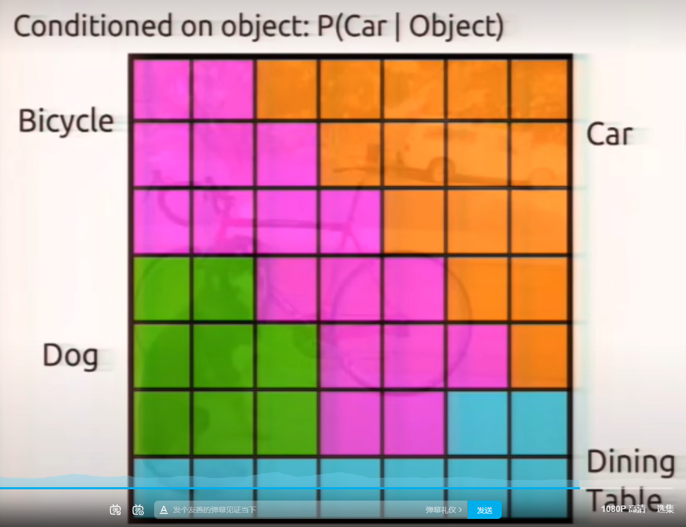
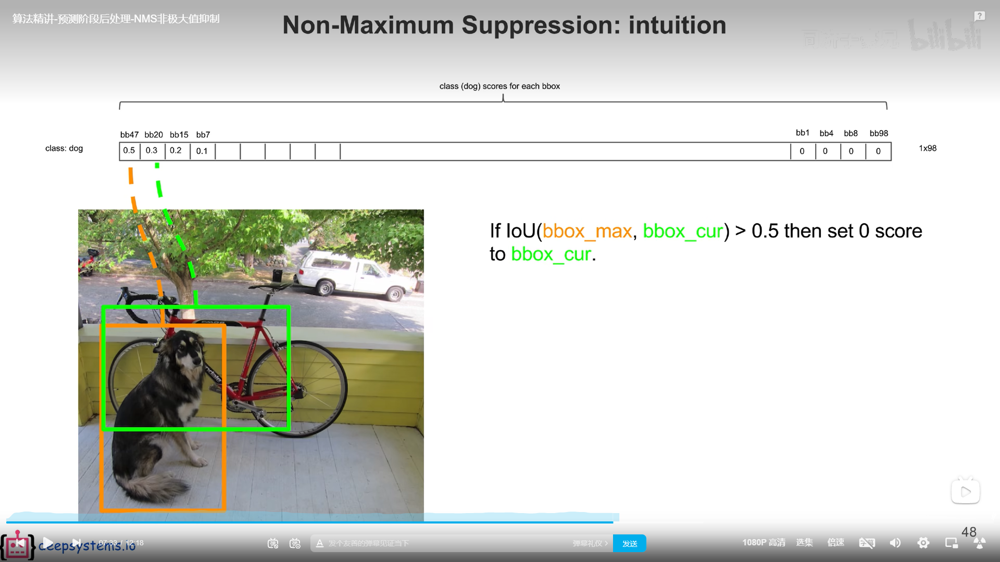

# YOLO v1

## 什么是IoU(Intersection over Union)
​      IoU是一种测量在特定数据集中检测相应物体准确度的一个标准。IoU是一个简单的测量标准，只要是在输出中得出一个预测范围(bounding boxex)的任务都可以用IoU来进行测量。为了可以使IoU用于测量任意大小形状的物体检测，我们需要：

ground-truth bounding boxes（人为在训练集图像中标出要检测物体的大概范围）
我们的算法得出的结果范围。
       也就是说，这个标准用于测量真实和预测之间的相关度，相关度越高，该值越高。如下图所示。绿色标线是人为标记的正确结果（ground-truth），红色标线是算法预测的结果（predicted）。

### 1、IoU的计算 
IoU是两个区域重叠的部分除以两个区域的集合部分得出的结果，通过设定的阈值，与这个IoU计算结果比较。

举例如下：绿色框是准确值，红色框是预测值。

## 预测阶段

**线的粗细代表置信分数**

**类别框，保存了置信分数最高的框的类**

## 训练阶段

**计算bound box框出的置信分数**

## 目标检测处理

### 非最大值抑制NMS(Non-Maximum Suppression)

  ## 训练阶段（反向传播）

一个grid cell 只能预测出一个物体，49个grid cell 只能预测出49个物体

### 损失函数

