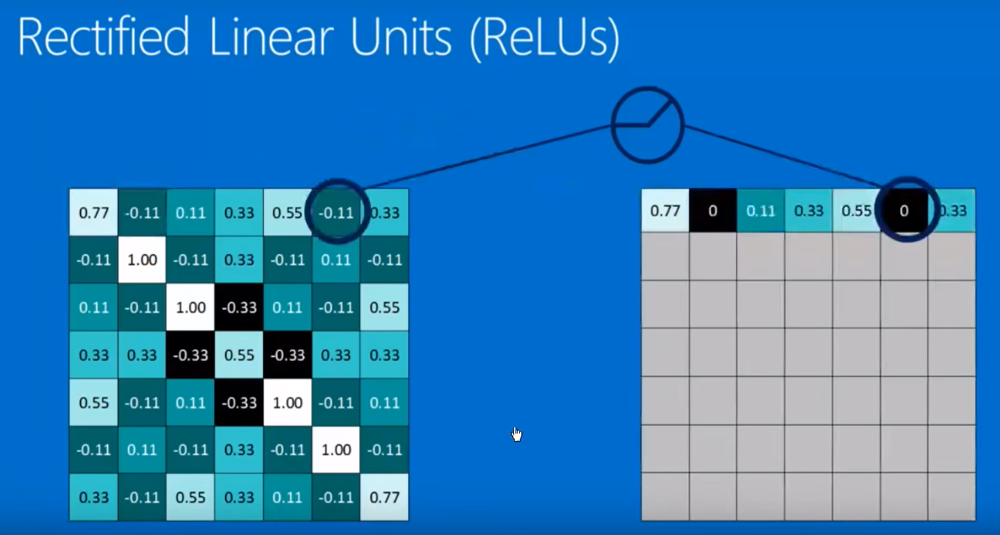

# 卷积神经网络

## 卷积

## 池化

> 

## 激活函数

## Convolution & ReLU & Pooling

 ## 全链接

## Learning ?

卷积核如何选择？

## 反向传播

## 梯度下降

## 框架

搭框架relay on experience

## 适用对象

图像 、 声音 、 文本 、 

## 限制

卷积神经网络

## 扩展

## channel

https://blog.csdn.net/weixin_38481963/article/details/109920512

## Conv2d

首先还是看官方文档对Conv2d的整体定义：

Conv2d，就是用来实现2d卷积操作的。要使用好这个类，我们先得搞清楚它的输入参数都是些啥？

in_channels —— 输入的channels数

out_channels —— 输出的channels数

kernel_size ——卷积核的尺寸，可以是方形卷积核、也可以不是，下边example可以看到

stride —— 步长，用来控制卷积核移动间隔

padding ——输入边沿扩边操作

padding_mode ——扩边的方式

bias ——是否使用偏置(即out = wx+b中的b)

以上参数，均是大家了解相对较多的参数项目。

dilation —— 这个参数简单说，设定了取数之间的间隔，下图可表达其意思

dilation = 1

dilation = 2

上图中蓝色为选取进行卷积计算的值。通过对比，即可了解该选项的作用

groups —— 进行分组卷积的组数

这个参数的使用不太好理解，首先还是贴原文档的说明

这个其实是将输入和输出进行分组，然后进行对应的映射，最后连接形成输出。引网络上的一张图，大概可以看出此参数的作用。引至：

[pytorch group 分组卷积](https://link.zhihu.com/?target=https%3A//www.jianshu.com/p/20ba3d8f283c)

参数的输入数据格式如下：

以上对参数进行了较为详尽的说明，基本上可以使用了！

官方给出了几个例子

1）方形卷积核、行列相同步长（*With square kernels and equal stride*）

m **=** nn**.**Conv2d(16, 33, 3, stride**=**2)

2）非方形卷积核、行列采用不同步长，并进行扩边

m **=** nn**.**Conv2d(16, 33, (3, 5), stride**=**(2, 1), padding**=**(4, 2))

3）非方形卷积核、行列采用不同步长、数据采用稀疏，并进行扩边

m **=** nn**.**Conv2d(16, 33, (3, 5), stride**=**(2, 1), padding**=**(4, 2), dilation**=**(3, 1))